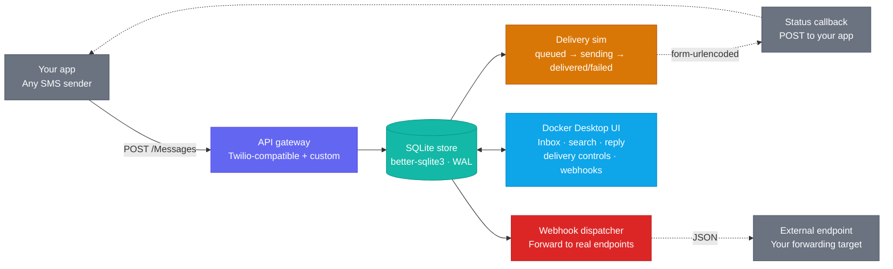

# SMSHog 📨

> MailHog for SMS. Capture, inspect, and simulate outbound SMS in local development — without sending a single real message.

## Features

| Feature | Details |
|---|---|
| **Twilio-compatible API** | Drop-in replacement — point your Twilio SDK at `http://localhost:9090` |
| **Simple custom API** | `POST /api/sms` for non-Twilio senders |
| **Live inbox** | UI polls every 2s; new messages appear within seconds of capture |
| **Search** | Filter by phone number or message body |
| **Delivery simulation** | Auto-advances `queued → sending → delivered/failed` with configurable delay and failure rate |
| **Manual status override** | Force any message into any status from the UI |
| **Simulated replies** | Send an inbound reply from the UI; optional webhook callback to your app |
| **Webhook forwarding** | Forward captured SMS to any endpoint in real time |
| **SQLite persistence** | Inbox survives container restarts — messages stored in `/app/data/smshog.db` |
| **`smshog-twilio` npm package** | Published helper — `patchTwilio`, `unpatchTwilio`, `createSmshogClient`. CJS + ESM + TypeScript. |

## Project structure

```
smshog/
├── backend/
│   ├── db.js          # SQLite persistence layer (better-sqlite3, WAL mode)
│   ├── server.js      # Express HTTP server (TCP :9090 + Unix socket for the extension UI)
│   └── package.json
├── ui/
│   ├── src/
│   │   ├── App.jsx    # React UI — inbox, webhooks, settings tabs
│   │   └── main.jsx
│   ├── index.html
│   └── package.json
├── packages/
│   └── smshog-twilio/ # Standalone npm package
│       ├── index.js   # CJS implementation (zero runtime deps)
│       ├── index.mjs  # ESM re-export
│       ├── index.d.ts # TypeScript definitions
│       ├── test.js    # Node built-in test runner (node --test)
│       └── package.json
├── smshog.svg         # Extension icon
├── metadata.json      # Docker Desktop extension manifest
├── docker-compose.yaml
└── Dockerfile
```

## Installation

### Prerequisites

- [Docker Desktop](https://www.docker.com/products/docker-desktop/) 4.8 or later

### Docker Desktop extension

Install from a pre-built image:

```bash
docker extension install smshog:latest
```

Or build and install locally:

```bash
git clone https://github.com/your-org/smshog
cd smshog
docker build -t smshog:latest .
docker extension install smshog:latest
```

### npm helper package (optional)

If you use the Twilio Node SDK, install the companion package in your project:

```bash
npm install --save-dev smshog-twilio
```

This gives you `patchTwilio`, `unpatchTwilio`, and `createSmshogClient` — no Twilio credentials required in local dev or CI.

---

## How To Use

### 1. Send SMS to SMSHog

There are three ways to point your code at SMSHog instead of real Twilio:

**Patch an existing Twilio client (Node.js):**

```js
const twilio = require('twilio');
const { patchTwilio } = require('smshog-twilio');

const client = twilio(process.env.TWILIO_SID, process.env.TWILIO_TOKEN);
if (process.env.NODE_ENV !== 'production') patchTwilio(client);

await client.messages.create({
  to: '+15555550100',
  from: '+15555550199',
  body: 'Your OTP is 123456',
});
```

**Use a fake Twilio client (no credentials needed — ideal for CI):**

```js
const { createSmshogClient } = require('smshog-twilio');
const client = createSmshogClient();
await client.messages.create({ to: '+1...', from: '+1...', body: 'Hello CI' });
```

**POST directly (any language):**

```bash
curl -X POST http://localhost:9090/api/sms \
  -H 'Content-Type: application/json' \
  -d '{"to":"+15555550100","from":"+15555550199","body":"Your OTP is 123456"}'
```

### 2. Inspect messages in the UI

Open Docker Desktop and click the **SMSHog** tab. Three tabs are available:

- **Inbox** — view captured messages, search by phone number or body, manually override delivery status, and simulate inbound replies
- **Webhooks** — configure endpoints that receive a copy of every captured SMS in real time
- **Settings** — enable/disable delivery simulation, set delay, and configure the failure rate

### 3. Configure the SMSHog URL

By default SMSHog listens on `http://localhost:9090`. If you run it under a different host or port, set the environment variable before starting your app:

```bash
SMSHOG_URL=http://smshog:9090 node your-app.js
```

Or pass it as an option when patching:

```js
patchTwilio(client, { url: 'http://smshog:9090' });
```

---

## Quickstart

### 1. Install the Docker Desktop extension

```bash
docker extension install smshog:latest
```

Or build locally:

```bash
git clone https://github.com/your-org/smshog
cd smshog
docker build -t smshog:latest .
docker extension install smshog:latest
```

### 2a. Twilio SDK — use the npm package

```bash
npm install --save-dev smshog-twilio
```

**Patch an existing client:**

```js
const twilio = require('twilio');
const { patchTwilio } = require('smshog-twilio');

const client = twilio(process.env.TWILIO_SID, process.env.TWILIO_TOKEN);

// One line — all client.messages.create() calls go to SMSHog in dev
if (process.env.NODE_ENV !== 'production') patchTwilio(client);

// Works exactly the same as production — no other code changes needed
await client.messages.create({
  to: '+15555550100',
  from: '+15555550199',
  body: 'Your OTP is 123456',
  statusCallback: 'http://your-app:3000/sms/status',
});

// Restore the original Twilio client later if needed
unpatchTwilio(client);
```

**No Twilio credentials? Use the fake client (ideal for CI):**

```js
const { createSmshogClient } = require('smshog-twilio');

const client = createSmshogClient();
await client.messages.create({ to: '+1...', from: '+1...', body: 'Hello CI' });
```

**Custom SMSHog URL:**

```js
// Via option
patchTwilio(client, { url: 'http://smshog:9090', verbose: false });

// Or via environment variable (applies to all calls)
SMSHOG_URL=http://smshog:9090 node your-app.js
```

**ESM / TypeScript:**

```ts
import { patchTwilio, unpatchTwilio, createSmshogClient } from 'smshog-twilio';
import twilio from 'twilio';

const client = twilio(process.env.TWILIO_SID!, process.env.TWILIO_TOKEN!);
if (process.env.NODE_ENV !== 'production') patchTwilio(client);
```

See [`packages/smshog-twilio/README.md`](packages/smshog-twilio/README.md) for the full package API reference.

### 2b. Direct HTTP (any language)

```bash
curl -X POST http://localhost:9090/api/sms \
  -H 'Content-Type: application/json' \
  -d '{"to":"+15555550100","from":"+15555550199","body":"Your OTP is 123456"}'
```

**Python:**
```python
import requests
requests.post('http://localhost:9090/api/sms', json={
    'to': '+15555550100',
    'from': '+15555550199',
    'body': 'Your verification code is 789012',
    'statusCallbackUrl': 'http://your-app:8000/sms/status',
})
```

### 2c. Twilio Unit Tests

```bash
node --test c:\src\sms-hog\packages\smshog-twilio\test.js
```

### 3. Open Docker Desktop → SMSHog tab

Messages appear in real time. The UI has three tabs:

- **Inbox** — search, inspect, manually override delivery status, simulate replies
- **Webhooks** — add/pause/delete forwarding rules to external endpoints
- **Settings** — toggle delivery simulation, configure delay and failure rate

## Persistence

Messages, webhooks, and settings are stored in a SQLite database at `$SMSHOG_DATA_DIR/smshog.db` (default: `/app/data/smshog.db`). The database runs in WAL mode for safe concurrent reads.

The `docker-compose.yaml` mounts a named Docker volume at `/app/data` so the inbox survives `docker compose restart`, image upgrades, and container recreation.

To reset the inbox: use the **✕** button in the UI, or `DELETE /api/messages`, or remove the volume:
```bash
docker volume rm smshog_smshog-data
```

For local dev (no Docker), the database is written to `./data/smshog.db` relative to the project root.

## REST API

### Send SMS (custom)
```
POST /api/sms
{ "to": "+1...", "from": "+1...", "body": "...", "statusCallbackUrl": "https://..." }
```

### Send SMS (Twilio-compatible)
```
POST /2010-04-01/Accounts/:sid/Messages.json
To=+1...&From=+1...&Body=...&StatusCallback=https://...
```

### List / search messages
```
GET /api/messages?q=search-term
```

### Delete a message / clear all
```
DELETE /api/messages/:id
DELETE /api/messages
```

### Override delivery status
```
POST /api/messages/:id/status
{ "status": "delivered" }   // queued | sending | sent | delivered | failed | undelivered
```

### Simulate a reply
```
POST /api/messages/:id/reply
{ "body": "Stop", "replyCallbackUrl": "https://your-app/inbound" }
```

### Webhooks
```
GET    /api/webhooks
POST   /api/webhooks          { "url": "https://..." }
PATCH  /api/webhooks/:id      { "active": false, "url": "https://..." }
DELETE /api/webhooks/:id
```

### Settings
```
GET   /api/settings
PATCH /api/settings
  { "deliverySimEnabled": true, "deliveryDelayMs": 1500, "deliveryFailRate": 0.05 }
```

### Health check
```
GET /healthz  →  { "ok": true, "version": "1.0.0" }
```

## Architecture



Solid arrows are the synchronous request path; dashed arrows are asynchronous side-effects (callbacks fired after delivery sim completes, webhooks forwarded to configured external endpoints).

## Environment variables

| Variable | Default | Description |
|---|---|---|
| `PORT` | `9090` | HTTP port (TCP for external SMS senders; Unix socket is always opened at `/run/guest-services/smshog.sock` for the Docker Desktop UI) |
| `SMSHOG_DATA_DIR` | `/app/data` | Directory for `smshog.db` |
| `SMSHOG_URL` | `http://localhost:9090` | Used by `smshog-twilio` to locate the server |

## Development (without Docker)

```bash
# Terminal 1 — backend
cd backend && npm install && npm run dev

# Terminal 2 — UI
cd ui && npm install && npm run dev
# open http://localhost:3000
```

## Publishing the npm package

```bash
cd packages/smshog-twilio
node --test test.js        # run tests first
npm version patch          # or minor / major
npm publish
```

## Roadmap

- [ ] Multi-tenant accounts (separate inboxes per `AccountSid`)
- [ ] SMPP server mode
- [ ] MMS attachment preview
- [ ] Rate-limit simulation
- [ ] Export inbox as JSON/CSV
